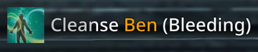

# Features
- Death Marker (with role, inc warrior/zerk as tank support)
- Low Health notification + sound for party members and yourself (percentage and sound type in settings)
- Low Mana notification + sound for party members and yourself (percentage and sound type in settings)
- Death notification + sound for party members and yourself (sound type in settings)
- Stun or Bleed notification + sound for all party members (sound type in settings)
- Vow of Rebirth / Rookie (Free self Resurrect) effect on players

# Settings
- **deathMarkers** - Enables the markers above dead party members with color of role they play at. (default: true)
- **deathWarning** - Enables the text warnings at the bottom when any party members dies. (default: true)
- **healthWarning** - Enables the text warnings at the bottom when any party members has less health than defined. (default: true)
- **manaWarning** - Enables the text warnings at the bottom when any party members has less mana than defined. (default: true)
- **healthPercentage** - Percentage between 1-100 to send the health warning for your health. (default:  65)
- **otherHealthPercentage** - Percentage between 1-100 to send the health warning for other party member's health. (default: 45)
- **manaPercentage** - Percentage between 1-100 to send the mana warning for your mana. (default: 20)
- **otherManaPercentage** - Percentage between 1-100 to send the mana warning for other party member's mana. (default: 25)
- **deathSound** - The sound that is played when the warning is showed. (default: 'notice')
- **deathSound** - The sound that is played when the warning is showed. (default: 'notice')
- **healthSound** - The sound that is played when the warning is showed. (default: 'notice')
- **manaSound** - The sound that is played when the warning is showed. (default: 'notice')
- **cleanseSound** - The sound that is played when the warning is showed. (default: 'notice')

(**sound options**: notice, cling1, cling2, whisper, bell1, bell2)

# Examples
  
  
  
  
  

Special thanks to [Owyn](https://github.com/Owyn/party_death_marker_pointers "Party Death Marker Pointers") for the Death-Marker resources

© 2019 Koekkruimels All Rights Reserved
